# Modpack-Einsteigerleitfaden

> Willkommen! Dieser Leitfaden richtet sich an Spieler, die Vanilla Minecraft kennen, aber neu bei Mods sind.
> Er behandelt die wichtigsten Mod-Kategorien in diesem Paket und bringt dich schnell auf den richtigen Weg.
> Du musst dich NICHT mit allem davon befassen -- such dir aus, was interessant klingt, und leg einfach los!

>Hinweis: Dies ist eine machinelle Übersetzung der Englischen Version. Die genaue Bezeichnung von Mod Gegenständen wird vermutlich abweichen.

---

## Inhaltsverzeichnis

- [Magie- und RPG-Mods](#magie--und-rpg-mods)
  - [Iron's Spells 'n Spellbooks](#irons-spells-n-spellbooks)
  - [Apotheosis](#apotheosis)
  - [Weitere Magie-Mods](#weitere-magie-mods)
- [Technik- und Automatisierungs-Mods](#technik--und-automatisierungs-mods)
  - [Create](#create)
  - [Applied Energistics 2](#applied-energistics-2)
  - [Immersive Engineering](#immersive-engineering)
- [Essen- und Landwirtschafts-Mods](#essen--und-landwirtschafts-mods)
  - [Farmer's Delight](#farmers-delight)
  - [Mystical Agriculture](#mystical-agriculture)
- [Neue Dimensionen](#neue-dimensionen)
  - [The Aether](#the-aether)
  - [Deeper and Darker](#deeper-and-darker)
  - [The Undergarden](#the-undergarden)

---

# Magie- und RPG-Mods

Dieses Paket verfügt über ein reichhaltiges Magiesystem, das auf Zaubern, Verzauberungen und Erkundung basiert.
Stell es dir als vollständige RPG-Ebene vor, die auf deiner Minecraft-Welt aufbaut.

---

## Iron's Spells 'n Spellbooks

**Was ist das?**
Iron's Spells 'n Spellbooks fügt ein vollständiges Magiesystem mit über 100 Zaubern aus
neun Schulen der Magie hinzu: Feuer, Eis, Blut, Ender, Beschwörung, Blitz, Heilig, Natur
und Leere. Du sammelst Zauberrollen, schreibst sie in ein Zauberbuch und wirkst sie
mit Mana. Jeder Zauber hat mehrere Stufen und wird stärker, wenn du deine Ausrüstung
und Gegenstände aufwertest -- das lässt deinen Magier-Build wirklich progressiv wirken, nicht nur ausrüstungsabhängig.

   
<ins>Ich möchte mehr wissen</ins>

   **So fängst du an:**

   1. Beginne sofort mit der Erkundung. Zauberrollen und Arkane Essenz fallen aus Schatztruhen
      in Strukturen und von feindseligen Kreaturen in der Welt. Die Mod fügt sieben einzigartige
      Strukturen hinzu -- halte Ausschau nach **Zaubertürmen** und ähnlichen Gebäuden -- und das Töten der
      Zaubererfeinde darin ist eine der besten frühen Quellen für Rollen und Ausrüstung.

   2. Sobald du eine Zauberolle hast, fertige einen **Einschreibtisch** an. Das ist
      die Werkstation, an der du Rollen in Zauberbücher steckst, um Zauber zu erlernen.

      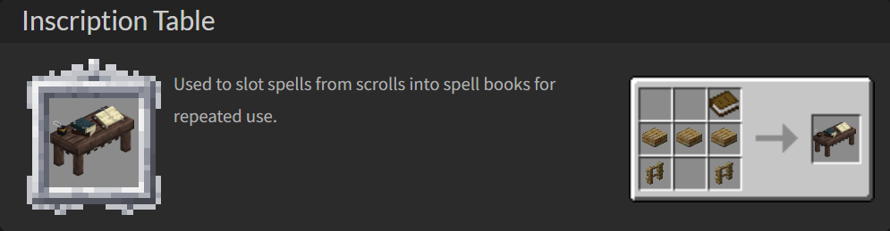

   3. Fertige dein erstes Zauberbuch an. Das günstigste ist das **Lumpige Tagebuch** oder das
      **Eisengebundene Buch** -- diese haben eine begrenzte Anzahl von Zauberschlitzen. Zauberbücher
      folgen Vanilla-Stufen (Eisen, Diamant, Netherit), wobei höhere
      Stufen mehr Zauber fassen und mehr Mana bieten.

   4. Rüste das Zauberbuch in deiner Haupthand aus. Verwende **V** (Standard-Taste), um
      den aktuell ausgewählten Zauber zu wirken. Wechsle deine Zauber mit **R** (Standard-Taste).
      Du kannst auch einen **Stab** in deiner Haupthand ausrüsten und rechtsklicken, um zu wirken, was
      deine Nebenhand für einen Schild oder einen anderen Gegenstand freimacht (oder umgekehrt).

   5. Sobald du genug **Arkane Essenz** hast, fertige das **Wandernder Magier**-Rüstungsset an
      (Lederrüstung kombiniert mit Arkaner Essenz). Es ist günstig und gibt sofort bedeutende
      Mana- und Zauberkraft-Boni -- eine große Verbesserung gegenüber nichts.

   6. Im mittleren Spielverlauf schalte den **Arkanen Amboss** frei. Er ermöglicht dir:
      - Zwei identische Rollen derselben Stufe zu kombinieren, um eine höherstufige Version zu erstellen
      - Zauber direkt auf Waffen zu binden (z. B. ein Schwert mit einem Feuerball-Aufladung)
      - Deine Zauberschlitz-Kapazität mit **Kleinen Zauberschlitz-Upgrades** zu erhöhen

   7. Für Tinte und spätes Rollenfertigen verwende den **Alchemisten-Kessel** (stelle ihn
      über ein Lagerfeuer, füge Wasser hinzu und wirf unerwünschte Zauber hinein, um Tinten zu brauen). Tinten werden
      in der **Rollenschmiede** verwendet, um benutzerdefinierte Rollen deiner gewählten Schule zu fertigen.

   **Die drei Fortschrittsphasen:**

   | Phase        | Ziel                                                                    |
   |--------------|-------------------------------------------------------------------------|
   | Früh         | Strukturen erkunden, Rollen und Arkane Essenz plündern                  |
   | Mittelspiel  | Arkanen Amboss bauen, Zauberstufen aufwerten, Tinte brauen              |
   | Spätes Spiel | Bosse besiegen (der Tote König, Feuer-Boss), legendäre Ausrüstung freischalten |

   **Wichtige Gegenstände:**

   | Gegenstand              | Was er bewirkt                                              |
   |-------------------------|-------------------------------------------------------------|
   | Zauberolle              | Enthält einen Zauber; in ein Buch einschreiben, um ihn zu nutzen |
   | Arkane Essenz           | Kern-Herstellungsmaterial für alle Zauberausrüstung         |
   | Einschreibtisch         | Werkstation zum Einsetzen von Rollen in Zauberbücher        |
   | Arkaner Amboss          | Wertet Zauber auf, bindet Zauber an Waffen                  |
   | Alchemisten-Kessel      | Braut Tinten aus Zaubern für spätes Rollenfertigen          |
   | Wandernder-Magier-Set   | Günstige frühe Rüstung mit Mana- und Zauberkraft-Boni       |
   | Stab                    | Zauber wirken durch Rechtsklick; befreit deine Nebenhand    |
   | Schulenspezifische Rüstung | 10 Rüstungssets, jedes stärkt eine bestimmte Magieschule |

   **Wiki:** [https://iron.wiki/](https://iron.wiki/)

   > **Profi-Tipp:** Es gibt ein In-Game-Führungsbuch für diese Mod, zugänglich über Patchouli.
   > Führe den Befehl `/give @p patchouli:guide_book[patchouli:book="irons_spellbooks:iss_guide_book"]`
   > im Chat aus, um es zu erhalten. Es behandelt alles von Zauberschulen bis zu Fortschrittsschritten
   > und ist früh im Spiel sehr lesenswert.

 

[^ Zurück nach oben](#inhaltsverzeichnis)

---

## Apotheosis

**Was ist das?**
Apotheosis überarbeitet mehrere Vanilla-Systeme und fügt neue RPG-artige Beute-Ebenen hinzu.
Seine Module umfassen Verzauberung, Spawner, Tränke und ein vollständiges Abenteuer-/Affix-System.
Für neue Spieler sind die unmittelbar wirkungsvollsten Teile die **Verzauberungs-Überarbeitung**
und das **Affix-Beute**-System -- Letzteres macht das Erkunden wirklich lohnend, indem
es zufällige mächtige Boni zu der Ausrüstung hinzufügt, die du findest.

Erhalte den In-Game-Leitfaden, indem du eine **Chronik der Schatten** herstellst (ein Buch und ein Gold-
Barren). Lies es! Es behandelt alles und wird basierend auf dem aktualisiert, was in deinem
Modpack aktiviert ist.

   
<ins>Ich möchte mehr wissen</ins>

   **Verzauberungs-Überarbeitung:**

   Apotheosis ersetzt das Vanilla-"Würfle eine zufällige Kombination"-Verzaubern durch ein Drei-Statistiken-
   System. Anstatt eines Slots, der Stufen kostet, siehst du jetzt drei Werte:

   - **Eterna** -- entspricht der Vanilla-Verzauberungsstärke (mehr Bücherregale = mehr Eterna)
   - **Quanta** -- erhöht die Variabilität der Verzauberungen (höheres Risiko, höhere Belohnung)
   - **Arcana** -- schaltet seltenere und mächtigere Verzauberungsoptionen frei

   Der Vanilla-Verzauberungstisch reicht mit den richtigen Regalen bis Stufe 150.
   Du kannst Verzauberungen auch einzeln auswählen, und die Amboss-Begrenzung wurde
   entfernt.

   **Regal-Fortschritt** (stelle diese um deinen Verzauberungstisch für mehr Stärke):

   Beginne mit Vanilla-Bücherregalen, dann schreite durch Nether-Material-Regale wie
   **Höllenregal** und **Meeresregal** fort, bis hin zum Endgame **Drakonisches Endregal** für
   das maximal mögliche Verzauberungssetup.

   **Affix-Beute:**

   Jedes Ausrüstungstück, das du in der Welt findest, hat jetzt eine Chance, ein Affix-Item zu sein -- ein
   farbiger, benannter Drop mit zufälligen Boni wie "verursacht Feuerschaden beim Treffen" oder
   "gewährt zusätzliche Bewegungsgeschwindigkeit." Diese kommen in fünf Seltenheiten: Gewöhnlich, Ungewöhnlich, Selten,
   Episch und Mythisch. Items haben auch **Edelstein-Fassungen**, die du mit gefassten
   Edelsteinen füllen kannst, die von feindseligen Kreaturen fallen gelassen werden, für weitere Boni.

   Zerlege Affix-Items, die du nicht willst, in einem **Bergungstisch**, um Seltenheitsmaterialien zu erhalten,
   die du dann an einem **Umschmiedetisch** verwendest, um eigene Affix-Items zu würfeln.

   **Weltstufen und Bosse:**

   Wenn du erkundest, schreitet die Welt durch Weltstufen fort (anzeigen/auswählen: STRG + T). 
   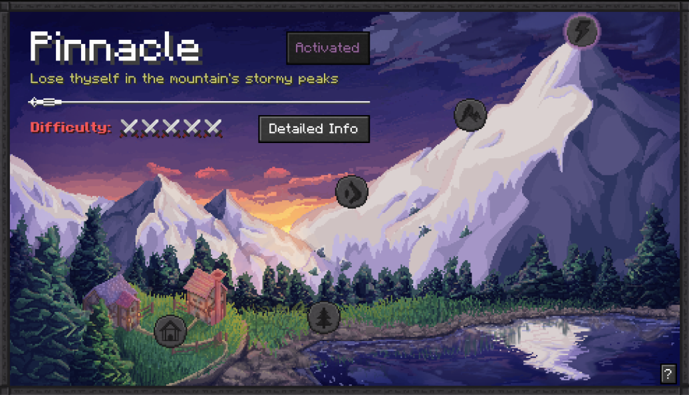
   Ab Stufe 1 (Grenzland) beginnen **Apothische Eindringlinge** zu erscheinen -- verstärkte, benannte Feinde, die
   garantiert hochwertige Affix-Items fallen lassen. Sie werden durch einen Lichtstrahl vom
   Himmel und einen lauten Klang angekündigt. Das Besiegen deines ersten Eindringlings ist erforderlich, um zur nächsten
   Weltstufe aufzusteigen.

   **Was fügt Apotheosis sonst noch hinzu?**
   - **Spawner-Überarbeitung:** Hebe Spawner mit Seidenhand auf. Modifiziere ihre Spawnrate,
   Kreaturen und Bedingungen. Extrem leistungsfähig für Kreaturfarmen.
   - **Neue Tränke:** Neue Gebräue mit Effekten, die in Vanilla nicht zu finden sind.
   - **Spinnweben** entfernen Verzauberungen von Items; **Prismatische Spinnweben** entfernen Flüche.

   > **Profi-Tipp:** Wirf farbige Affix-Items nicht weg, auch wenn die Werte schlecht sind.
   > Zerleg sie am Bergungstisch für Seltenheitsmaterialien -- du wirst diese
   > später für den Umschmiedetisch brauchen, und sie stapeln sich schnell, wenn du sie von
   > Anfang an aufbewahrst.

[^ Zurück nach oben](#inhaltsverzeichnis)

---

## Weitere Magie-Mods

Dieses Paket hat mehrere weitere Magie-Mods, die es wert sind, gekannt zu werden. Sie sind etwas spezieller,
fügen aber großartige Tiefe hinzu, sobald du dich mit Iron's Spellbooks und Apotheosis wohlfühlst.

**Darker Magic**
Fügt Schatten- und Dunkelmagiezauber und Rituale hinzu. Passt natürlich zu den Leere- und
Blut-Schulen von Iron's Spellbooks. Suche in Dungeons und
dunklen Strukturen nach Darker Magic-Büchern. Eine tolle Wahl, wenn du einen finsteren Zauberer-Build möchtest.

**Discerning the Eldritch**
Eine kosmische Horror-Magie-Mod mit seltsamen Artefakten und eldritischen Zaubern. Findet
ihren Inhalt in seltenen Strukturen und tiefen unterirdischen Ruinen. Komplexer, aber sehr
lohnend zu erkunden.

**Thaumon**
Eine thaumaturgisch inspirierte Magie-Mod mit Zauberstäben, runenbasierter Herstellung und einem Forschungs-
system. Aufwändiger als die anderen -- hebe das für das Mittelspiel auf, wenn deine Basis
etabliert ist.

> Diese Mods passen natürlich zu Iron's Spellbooks. Baue dein Kern-Zauberladeout auf
> und gewöhne dich zuerst an das Mana-Management, dann verzweige in diese für
> extra Geschmack und zusätzliche Kraftquellen.

[^ Zurück nach oben](#inhaltsverzeichnis)

---

# Technik- und Automatisierungs-Mods

Die technische Seite dieses Pakets konzentriert sich auf **Create**, eine der visuell
befriedigendsten und mechanisch einzigartigsten Automatisierungs-Mods, die je erstellt wurden. Sie wird gepaart mit
Applied Energistics 2 für Massenspeicherung und Immersive Engineering für eine industrielle
Ästhetik und zusätzliche Maschinen.

---

## Create

**Was ist das?**
Create ist eine mechanische Ingenieurs-Mod, die auf **Rotation und Bewegung** aufbaut. Anstatt
Maschinen zu platzieren und sie mit Kabeln zu verbinden wie die meisten Technik-Mods, baust du
physische Konstruktionen mit Zahnrädern, Wellen, Riemen und beweglichen Teilen. Fabriken in
Create wirken lebendig -- sie drehen sich, bewegen sich und animieren in Echtzeit. Fast alles
läuft auf **Rotationskraft**, gemessen in **Stresseinheiten (SU)** und **UPM**.

**Das Kernkonzept:**
Jedes Create-System hat zwei Seiten: **Generatoren**, die Stresskapazität bereitstellen
(wie ein Wasserrad), und **Verbraucher**, die Stressbelastung nutzen (wie eine Mechanische
Presse). Solange deine gesamte Stresskapazität größer oder gleich deiner gesamten
Stressbelastung ist, läuft das gesamte Netz. Wenn du zu viele Maschinen hinzufügst, ohne weitere
Generatoren hinzuzufügen, wird das System **überbeansprucht und stoppt vollständig**.

   
<ins>Ich möchte mehr wissen</ins>

   **So fängst du an:**

   1. Deine erste Aufgabe ist die Herstellung von **Messing**, dem Kern-Create-Material. Messing wird durch
      Mischen von Kupfer und Zink in einem **Mechanischen Mischer** über einem **Becken** hergestellt. Um aber den
      Mischer zu betreiben, brauchst du zuerst eine Rotationsquelle.

   2. Baue ein **Wasserrad** für deine erste Rotationsquelle. Platziere es in einem Fluss oder
      richte zwei Wasserquellen auf gegenüberliegenden Seiten davon ein. Die Richtung des Wasserstroms
      bestimmt die Rotationsrichtung -- verbinde es mit deinen Maschinen über
      **Wellen** und **Getriebekästen**.

      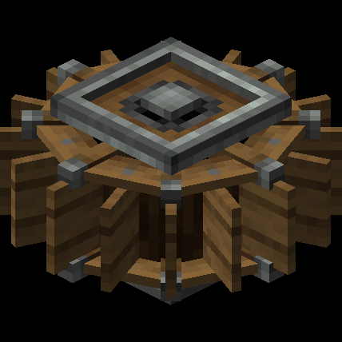

   3. Verbinde das Wasserrad über Wellen mit einer **Mechanischen Presse**. Die Presse ist deine
      wichtigste frühe Maschine -- sie presst Eisenbarren zu Blechen, die
      für fast jedes Create-Rezept erforderlich sind.

   4. Arbeite als nächstes auf die **Mischer + Becken**-Kombination zum Schmelzen von Messing hin. Sobald du
      Messing hast, öffnet sich die gesamte Mod: schnellerer Transport (Riemen), bessere Maschinen, und
      schließlich Züge, fliegende Maschinen und vieles mehr.

   **Nützliche Geschwindigkeitstipps:**
   - Verwende **Kleine Zahnräder auf Großen Zahnrädern**, um die Rotationsgeschwindigkeit zu verdoppeln (aber das
   verdoppelt auch die Stressbelastung auf verbundene Maschinen)
   - Verwende **Große Zahnräder auf Kleinen Zahnrädern**, um die Geschwindigkeit zu halbieren (und Stress zu halbieren)
   - Ein **Rotationsgeschwindigkeits-Controller** lässt dich eine genaue UPM einstellen -- sehr nützlich

   **Wichtige frühe Maschinen:**

   | Maschine                | Was sie tut                                                   |
   |-------------------------|---------------------------------------------------------------|
   | Wasserrad               | Erzeugt Rotation aus fließendem Wasser                       |
   | Windmühlen-Lager        | Erzeugt Rotation aus Segeln in freier Luft (mehr Leistung)   |
   | Mechanische Presse      | Presst Barren zu Blechen, verdichtet Gegenstände             |
   | Mechanischer Mischer    | Mischt Materialien in einem Becken (Legierungen, Essen, mehr)|
   | Mühlstein               | Mahlt Materialien zu Pulver (Weizen zu Mehl, usw.)           |
   | Mechanischer Riemen     | Transportiert Gegenstände und überträgt Rotation seitwärts   |
   | Einsetzer               | Ein Roboterarm, der Gegenstände auf Blöcken oder Entitäten "nutzt" |
   | Schacht / Trichter      | Bewegt Gegenstände zwischen Maschinen vertikal/von den Seiten |

   **Create-Add-ons in diesem Paket:**
   - **Create: Aeronautics + Aeroworks** -- Baue echte fliegende Luftschiffe!
   - **Create: Big Cannons** -- Funktionale, physikbasierte Artillerie.
   - **Create: New Age** -- Elektrische Energie für Create-Maschinen.
   - **Create: Diesel Generators** -- Kraftstoffbetriebene Rotationsquelle, toll im Mittelspiel.
   - **Create: Railways Navigator** -- Vollständiges Zugnetz mit einer Streckenplaner-Oberfläche.
   - **Create: Nuclear** -- Spätes Spiel Atomkraft.
   - **Create: Enchantable Machinery** -- Verzaubere Maschinen für Boni.

   > **Profi-Tipp:** Halte einen beliebigen Create-Gegenstand und drücke **W** (Standard), um das **Ponder**-
   > System zu öffnen -- ein animiertes In-Game-Tutorial für genau diesen Block. Es ist eines der
   > besten In-Game-Tutorials in jeder Mod. Nutze es ständig, besonders wenn du dir unsicher bist,
   > wie eine Maschine funktionieren soll oder verbunden werden soll.

[^ Zurück nach oben](#inhaltsverzeichnis)

---

## Applied Energistics 2

**Was ist das?**
Applied Energistics 2 (AE2) ist eine Massenspeicher- und Logistik-Mod. Es ermöglicht dir, tausende
von Gegenständen über einige wenige **Speicherzellen** zu speichern und auf alles
über ein einziges durchsuchbares **ME-Terminal** zuzugreifen. Im späten Spiel kann es fast
alles auf Abruf automatisch herstellen. "ME" steht für Materienergie.

   
<ins>Ich möchte mehr wissen</ins>

   **So fängst du an:**

   1. Dein allererster Schritt ist das Finden eines **Meteoriten**. Diese hinterlassen große Krater und
      Löcher im Terrain, sodass du vielleicht schon einen gesehen hast. Wenn nicht, fertige einen
      **Meteoriten-Kompass** an (benötigt eine kleine Menge Certus-Quarz, der unterirdisch vorkommt).
      Der Kompass zeigt auf den nächsten Meteoriten.

      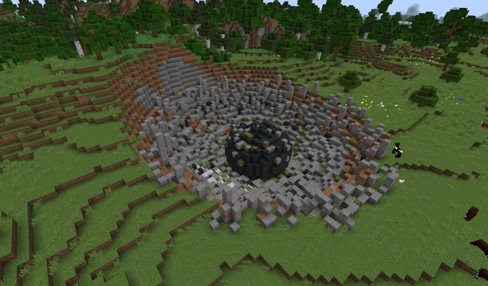

   2. Grabe in das **Zentrum** des Meteoriten, um den **Mysteriösen Würfel** zu finden. Brich ihn,
      um alle **vier Einschreiber-Pressen** zu erhalten -- diese sind erforderlich, um die
      Prozessoren herzustellen, die dein ME-Netz benötigt. Baue auch die **Certus-Quarz-Cluster** und alle
      **Knospenden Certus-Quarz-Blöcke** ab, die du findest (verwende Seidenhand auf knospenden Blöcken --
      ohne sie degradieren sie um eine Stufe).

      > **Wichtig:** Brich niemals einen **Makellosen Knospenden Certus**-Block, auch nicht mit
      > Seidenhand. Sie können nicht repariert werden und werden degradieren. Lass sie an Ort und Stelle
      > oder bewege sie später mit Räumlichem Speicher.

   3. Platziere zurück an deiner Basis **Wachstumsbeschleuniger** neben deinen Knospenden Certus-Blöcken,
      um das Certus-Kristallwachstum dramatisch zu beschleunigen. Sobald du genug Certus hast, stelle
      **Fluix-Kristalle** her, indem du Geladenen Certus-Quarz, Redstonestaub und Nether-
      Quarz zusammen in einen Wasserteich wirfst.

      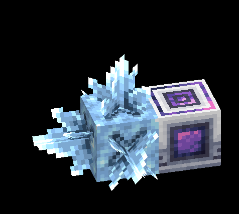

   4. Fertige einen **Einschreiber** an und verwende deine vier Pressen, um die drei Prozessortypen
      herzustellen (Logik, Berechnung, Ingenieurwesen). Du hast jetzt alles, was du für dein erstes
      ME-System brauchst.

   5. Baue ein minimales erstes Netz:
      - **ME-Controller** -- das Gehirn des Netzes (benötigt Energie)
      - **Energieakzeptor** -- wandelt Energie von Create oder IE in ME-Energie um
      - **ME-Laufwerk** -- hält Speicherzellen
      - **ME-Terminal** -- dein Zugangspunkt; an einem Kabel befestigen, das mit dem oben verbunden ist

      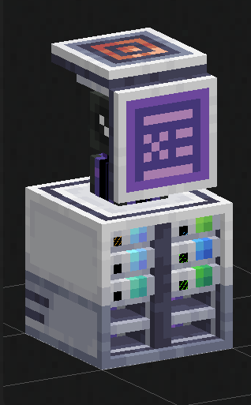

   **Wichtige AE2-Konzepte:**

   | Begriff           | Was es bedeutet                                                 |
   |-------------------|-----------------------------------------------------------------|
   | Speicherzelle     | Eine Karte, die in ein ME-Laufwerk eingesteckt wird; hält Gegenstände digital |
   | Kanäle            | Jedes Kabel trägt eine begrenzte Anzahl verbundener Geräte     |
   | ME-Controller     | Erforderlich für Netze mit mehr als 8 Geräten                  |
   | Automatisches Herstellen | Richte Muster ein, damit das Netz Gegenstände für dich herstellt |
   | P2P-Tunnel        | Leitet Kanäle sauber durch Wände für große Netze               |

   **Wiki:** [https://guide.appliedenergistics.org/1.21.1/getting-started](https://guide.appliedenergistics.org/1.21.1/getting-started)

   > **Profi-Tipp:** Beginne nur mit einem Controller, Energieakzeptor, Laufwerk und Terminal.
   > Mach dir noch keine Sorgen über automatisches Herstellen -- sogar ein grundlegendes durchsuchbares Inventar für deine
   > gesamte Basis ist eine massive Verbesserung der Lebensqualität. Eine **4k-Speicherzelle** als deine
   > erste Zelle deckt die meisten Bedürfnisse des frühen bis mittleren Spiels ab.

[^ Zurück nach oben](#inhaltsverzeichnis)

---

## Immersive Engineering

**Was ist das?**
Immersive Engineering (IE) fügt ein retro-industrielles Flair mit **Multi-Block-Maschinen** hinzu
-- Strukturen, die aus mehreren platzierten Blöcken statt einem einzelnen Maschinenblock gebaut werden.
Alles in IE ist groß und physisch: hängende Stromkabel, ein Koksofen, der Rauch ausstößt,
ein Brecher, der höher ist als dein Spieler. Es ergänzt Create perfekt für eine
vollständige Industriebasis.

   
<ins>Ich möchte mehr wissen</ins>

   **So fängst du an:**

   1. Fertige zuerst das **Ingenieurhandbuch** an -- ein Buch kombiniert mit einem Hebel. Dieser
      In-Game-Leitfaden hat detaillierte Anweisungen und 3D-Baupläne für jede Maschine in
      der Mod. Es ist dein wichtigster Gegenstand. Behalte es in deiner Schnellleiste.

   2. Fertige den **Ingenieurshammer** an (2 Eisenbarren + 2 Stöcke + 1 Faden). Dieses Werkzeug
      ist erforderlich, um jede Multi-Block-Struktur zu **formen**. Nachdem du alle Blöcke
      für eine Maschine platziert hast, rechtsklicke die richtige Seite mit dem Hammer, um sie zusammenzubauen.

   3. Dein erster Multi-Block ist der **Koksofen** -- ein 3x3x3 Würfel aus Koksziegeln.
      Er nimmt Kohle und verwandelt sie in **Koks** (ein überlegener Brennstoff) und produziert
      **Kreosotöl** als Nebenprodukt. Kreosotöl ist erforderlich, um **Behandeltes Holz** herzustellen,
      das in fast jeder IE-Maschine verwendet wird.

      <!-- IMAGE PLACEHOLDER -->
      <!-- Screenshot: The Coke Oven multi-block assembled and running, with smoke particles -->
      <!-- Source: https://ftb.fandom.com/wiki/Coke_Oven_(Immersive_Engineering) -->
      

   4. Baue als nächstes den **Groben Hochofen** (auch ein Multi-Block), um **Stahl**
      aus Eisen und Koks herzustellen. Stahl wird für fast alle mittleren und späten IE-
      Maschinen benötigt. Dann rüste ihn auf einen **Verbesserten Hochofen** auf, sobald du ein wenig
      Stahl hast, was automatisierte Eingaben und Ausgaben über Trichter ermöglicht.

   5. IE verwendet sein eigenes Energiesystem namens **Immersiver Fluss (IF)**. Die einfachste frühe
      Energiequelle ist der **Kinetische Dynamo**, der Rotationskraft von Create
      direkt in IF umwandelt. Verbinde ihn mit deinen Maschinen über **Drahtspulen**, die zwischen
      **Verbindern** gespannt sind.

      <!-- IMAGE PLACEHOLDER -->
      <!-- Screenshot: IE wire coils strung between two connectors on machines -->
      <!-- Source: https://www.minecraft-guides.com/mod/immersive-engineering/ -->
      

   **Wichtige IE-Gegenstände und Maschinen:**

   | Maschine / Gegenstand  | Was sie tut                                              |
   |------------------------|----------------------------------------------------------|
   | Koksofen               | Wandelt Kohle in Koks + Kreosotöl um                    |
   | Hochofen               | Schmilzt Eisen + Koks zu Stahl                           |
   | Brecher                | Mahlt Erze zu Grus -- verdoppelt deinen Ertrag           |
   | Lichtbogenofen         | Hochwertiger Masseneinschmelzer für Legierungen und hohen Durchsatz |
   | Kinetischer Dynamo     | Wandelt Create-Rotation in IE-Energie um                 |
   | Drahtspulen            | Visuelle, physische Energiekabel zwischen Maschinen      |
   | Ingenieursrevolver     | Eine mächtige und modifizierbare Schusswaffe             |
   | Railgun                | Spätspiel-Energiewaffe mit extremer Reichweite und Leistung |
   | Förderband             | IEs eigenes horizontales Gegenstands-Transportsystem     |

   > **Profi-Tipp:** Wenn ein Multi-Block sich weigert zu formen, wenn du ihn mit dem Hammer triffst, öffne
   > das Ingenieurhandbuch und schau dir den 3D-Bauplan für diese Maschine an. Überprüfe die Block-
   > Ausrichtung -- viele Maschinen müssen in eine bestimmte Richtung zeigen, um zu funktionieren, und der Hammer
   > kann sie vor dem Formen drehen. Das löst 95% der "Warum funktioniert es nicht"-Situationen.

[^ Zurück nach oben](#inhaltsverzeichnis)

---

# Essen- und Landwirtschafts-Mods

Essen in diesem Paket ist viel interessanter als in Vanilla. Die Essen-Mods fügen Hunderte
von Rezepten hinzu, und Mystical Agriculture verwandelt die Landwirtschaft in ein vollständiges Progressionssystem
für das passive Erhalten von Ressourcen über Zeit.

---

## Farmer's Delight

**Was ist das?**
Farmer's Delight ist das Essen-Fundament dieses Pakets. Es fügt einen richtigen Koch-
Workflow mit dedizierten Werkstationen, über zwanzig neue Pflanzen und Mahlzeiten hinzu, die
starke Statuseffekt-Boni geben. Viele andere Mods in diesem Paket (Cultural Delights, Ocean's
Delight, Vinery und viele mehr) fügen ihre eigenen Rezepte oben auf Farmer's Delights
Kochsystem hinzu.

> Folge den In-Game **Errungenschaften** für Farmer's Delight als deinen Haupt-Fortschrittsleitfaden.
> Drücke **L** (Standard), um den Errungenschafts-Bildschirm zu öffnen und suche nach dem
> Farmer's Delight-Tab. Die Errungenschaften führen dich Schritt für Schritt durch die Mod!

   
<ins>Ich möchte mehr wissen</ins>

   **So fängst du an:**

   1. Finde zuerst **Wilde Pflanzen** in der Welt -- sie wachsen in verschiedenen Biomen und
      manchmal in Schatztruhen. Wilder Kohl, Tomaten, Zwiebeln und Reis sind die, die
      du einmal finden musst, um sie anzubauen. Du kannst auch Samen in
      Dorfkisten und Schiffswracks finden.

   2. Fertige ein **Messer** an (ein beliebiger Barren + ein Stock im Herstellungsraster, vertikal). Das
      Messer ist dein primäres Farmer's Delight-Werkzeug. Es gibt einen garantierten sekundären Drop
      beim Töten von Kreaturen (garantiertes Leder von Kühen, garantierte Federn von Hühnern,
      usw.) -- sehr nützlich, bevor du anfängst zu kochen.

   3. Fertige ein **Schneidebrett** an (4 Bretter + 2 Stöcke). Platziere es und rechtsklicke es
      mit einer Zutat in der Hand, um sie auf das Brett zu legen, dann rechtsklicke
      mit dem entsprechenden Werkzeug, um es zu verarbeiten. Viele Kochrezepte erfordern **geschnittene** oder
      **gehackte** Versionen von Zutaten, die du nur hier herstellen kannst.

      <!-- IMAGE PLACEHOLDER -->
      <!-- Screenshot: A Cutting Board with a Tomato on it, being sliced with a Knife -->
      <!-- Source: https://github.com/vectorwing/FarmersDelight/wiki -->
      

   4. Fertige einen **Herd** an (4 Ziegel + 3 Eisenbarren + ein Lagerfeuer). Der Herd ist eine
      Verbesserung des Lagerfeuers, das bis zu vier Kochtöpfe gleichzeitig unterstützen kann und sechs
      Gegenstände gleichzeitig auf seiner Grillfläche kocht.

   5. Fertige einen **Kochtopf** an (5 Eisenbarren + Wassereimer + 2 Ziegel + Holzschaufel)
      und platziere ihn oben auf deinem Herd (oder einem Lagerfeuer, Lava oder Magmablock). Öffne ihn
      und platziere bis zu sechs Zutaten darin, dann lege eine **Schüssel** in den Ausgabeschlitz.
      Wenn erhitzt, beginnt es zu kochen. Die meisten Suppen und Eintöpfe kommen in Schüsseln heraus.

      <!-- IMAGE PLACEHOLDER -->
      <!-- Screenshot: Cooking Pot placed on a Stove, bubbling, with a bowl in the output -->
      <!-- Source: https://github.com/vectorwing/FarmersDelight/wiki -->
      

   **Wichtige Statuseffekte durch Essen:**

   | Effekt          | Was er bewirkt                                                  |
   |-----------------|------------------------------------------------------------------|
   | Nahrung         | Verhindert Hunger- und Sättigungsverlust; ermöglicht langsame Regeneration |
   | Komfort         | Entfernt vorübergehend Langsamkeit, Hunger und Schwäche         |
   | Regeneration    | Stellt über Zeit Gesundheit wieder her (toll vor dem Kampf)     |
   | Stärke          | Erhöht den Angriffsschaden                                       |
   | Widerstand      | Reduziert eingehenden Schaden (ausgezeichnet vor einem Dungeon-Tauchgang) |

   **Farmer's Delight-Add-ons in diesem Paket:**
   Verwende **EMI** (drücke **E** in deinem Inventar, um den Rezeptbetrachter zu öffnen), um jedes
   verfügbare Rezept zu durchsuchen. Es gibt Hunderte von Gerichten in Cultural Delights, Ocean's
   Delight, Aquaculture Delight, Barbeques Delight, Chef's Delight, Brewin and Chewin
   (Getränke!), Vinery und vielen mehr. Erkunde frei!

   > **Profi-Tipp:** Essen-Buffs stapeln sich. Eine gute Pre-Dungeon-Mahlzeitkombination -- ein Gericht mit
   > Widerstand und eines mit Regeneration -- kann den Unterschied in einem Bossfight machen.
   > Koche in großen Mengen: Der Kochtopf fasst mehrere Portionen, und die meisten Mahlzeiten stapeln sich gut.

[^ Zurück nach oben](#inhaltsverzeichnis)

---

## Mystical Agriculture

**Was ist das?**
Mystical Agriculture ermöglicht es dir, fast jede Ressource als Ernte anzubauen -- Erze, Kreaturdrops,
Edelsteine und sogar Materialien wie Diamant und Netherit. Es ersetzt das Grinden durch
geduldige, skalierbare Landwirtschaft. Ein vollständig entwickeltes Mystical Agriculture-Setup versorgt
deine Basis passiv rund um die Uhr mit Ressourcen.

> Mystical Agriculture-Ernten benötigen KEIN Wasser oder Licht! Sie brauchen nur das richtige
> Essenz-Ackerland und genug Platz darüber.

   
<ins>Ich möchte mehr wissen</ins>

   **So fängst du an:**

   1. Gehe bergbaulich nach den zwei Startmaterialien:
      - **Wohlstands-Erz** (zwischen Y -60 und Y 24) -- lässt Wohlstandssplitter fallen
      - **Inferium-Erz** (häufig unterirdisch) -- lässt Inferium-Essenz fallen

      Du kannst auch Inferium-Essenz erhalten, indem du feindselige Kreaturen tötest (ca. 20%
      Drop-Chance pro Kill), also wird dein frühes Abenteuer natürlich einen Vorrat aufbauen.

   2. Fertige **Inferium-Samen** an und pflanze sie auf normalem Ackerland. Für bessere
      Erträge rechtsklicke auf normales Ackerland mit einer Inferium-Essenz, um es
      in **Inferium-Essenz-Ackerland** umzuwandeln. Jede Stufe von Essenz-Ackerland erhöht das
      fallende Inferium pro Ernte um 50%.

      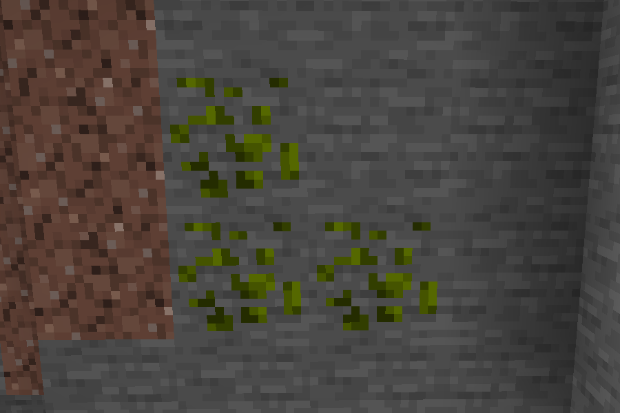

   3. Um Inferium-Essenz auf die nächste Stufe zu bringen, verwende einen **Infusions-Kristall**. Kombiniere
      vier der niedrigeren Stufe zu einer der höheren Stufe. Die vollständige Stufenleiter ist:
      **Inferium > Prudentium > Tertium > Imperium > Supremium**.

   4. Um Ressourcen-Samen herzustellen (Eisensamen, Diamantsamen usw.), baue einen
      **Infusionsaltar** mit **8 Infusionssockeln** darum. Platziere den Altar in
      der Welt und er zeigt dir genau, wo die Sockel hingehen. Versorge das Rezept
      mit einem Redstone-Signal. Samen benötigen eine Wohlstandssplitter-Samenbasis, die passende
      Stufenessenz und ein Stück der Ressource, die du anbauen möchtest.

      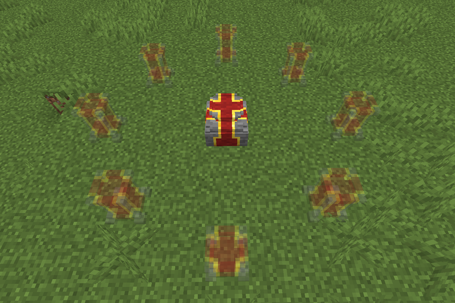

   5. Pflanze Ressourcen-Samen auf Essenz-Ackerland der passenden Stufe. Platziere
      **Wachstumsbeschleuniger** unter dem Ackerland, um das Wachstum zu beschleunigen -- sie stapeln sich,
      sodass mehr Beschleuniger schnellere Ernten bedeuten.

   **Essenz-Stufenübersicht:**

   | Stufe       | Samen, die du anbauen kannst                                    |
   |-------------|----------------------------------------------------------------|
   | Inferium    | Die Basis -- sammle dies zuerst aus Erz und Kreaturen          |
   | Prudentium  | Stein-, Erde-, Holz-, Wassersamen                              |
   | Tertium     | Eisen-, Kupfer-, Kohle-, Kieselsteinsamen                      |
   | Imperium    | Gold-, Lapislazuli-, Redstone-, Glühsteinsamen                 |
   | Supremium   | Diamant-, Smaragd-, Netherit-, Netherstern-Samen!              |

   **Spätspiel-Bonus:** Fertige **Essenz-Rüstung** und **Essenz-Werkzeuge** aus den obigen Stufen an.
   Ein vollständiges Supremium-Rüstungsset ermöglicht es dir zu fliegen. Du kannst die Ausrüstung weiter
   mit **Augmenten** auf einem **Bastelstisch** für Effekte wie Absorptionsherzen,
   Sprungboost, Feuerresistenz und mehr aufwerten.

   **Wiki:** [https://blakesmods.com/wiki/mysticalagriculture/guides/getting-started](https://blakesmods.com/wiki/mysticalagriculture/guides/getting-started)

   > **Profi-Tipp:** Mystical Agriculture ist eine langfristige Investition. Pflanze früh einen kleinen Fleck
   > Inferium-Samen, dann ignoriere ihn. Im Mittelspiel wirst du genug Essenz haben,
   > um mit der Herstellung von Ressourcen-Samen zu beginnen. Es funktioniert hervorragend mit einem Create-Mechanischen
   > Harvester auf einer sich bewegenden Konstruktion für eine vollständig automatisierte Ernte.

[^ Zurück nach oben](#inhaltsverzeichnis)

---

# Neue Dimensionen

---

## The Aether

**Was ist das?**
The Aether ist eine der ikonischsten Mods von Minecraft -- eine Himmeldimension, die das
genaue Gegenteil des Nethers ist. Sie ist hell, schwebend und voller Inseln, fremder
Kreaturen und drei einzigartiger Dungeons, jeder mit seinem eigenen Boss. Betrachte es als einen parallelen
Mittelspiel-Abenteuerpfad neben dem Nether.

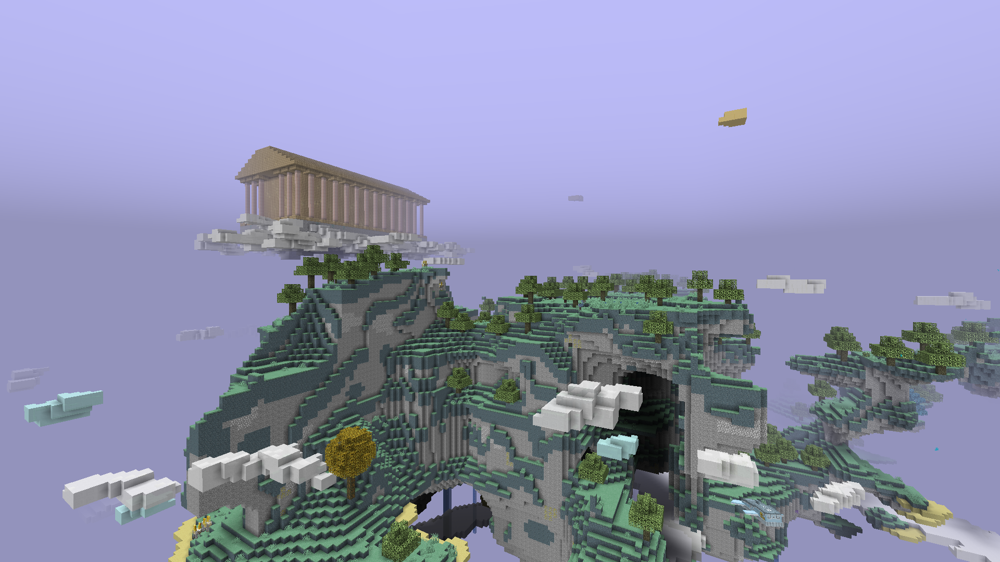

   
<ins>Ich möchte mehr wissen</ins>

   **So fängst du an:**

   1. Du brauchst zuerst **Leuchtstein-Blöcke** (zu finden an der Nether-Decke oder bei Piglin-Händlern). Baue einen Portalrahmen in der gleichen Form wie ein Nether-Portal, aber
      verwende **Leuchtstein-Blöcke** anstelle von Obsidian.

      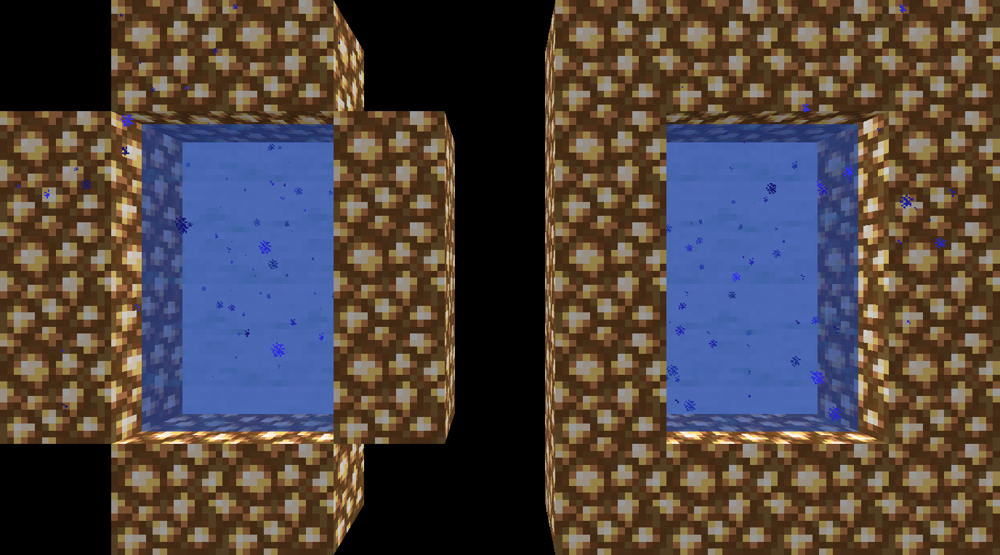

   2. Zünde es mit einem **Eimer Wasser** an (rechtsklicke das Innere des Rahmens).
      Das Portal wird blau und schimmernd. Tritt hindurch!

   3. Ein paar entscheidende Dinge, die du bei der Ankunft sofort wissen solltest:
      - **Normale Fackeln und Laternen können im Aether nicht platziert werden.** Verwende
      stattdessen **Ambrosium-Fackeln** (Ambrosium-Splitter über einem Himmelsstock).
      - **Vanilla-Werkzeuge bauen Aether-Blöcke so langsam ab wie deine bloße Hand.** Fertige
      sofort **Himmels-Werkzeuge** aus Himmelsholz-Stämmen (dem lokalen Holztyp) an.
      - **Vom Rand zu fallen schickt dich zurück in die Oberwelt**, wobei du hoch über
      deinem Portal spawnst. Platziere Wasser rund um deinen Portal-Ausgang, bevor du in der Nähe von Rändern erkundest!
      - Der Aether hat **Ewigen Tag**, bis du den finalen Dungeon-Boss besiegst.
      Du kannst bis dahin nicht in Betten schlafen.

   4. Sammle Ressourcen in dieser Reihenfolge:
      - **Himmelsholz** (das lokale Holz) für Werkzeuge und frühe Herstellung
      - **Heiliger Stein** (der lokale Stein) für bessere Werkzeuge
      - **Ambrosium-Splitter** (aus Ambrosium-Erz -- der Aether-Kohle) für Fackeln und Brennstoff
      - **Zanit-Edelsteine** (aus Zanit-Erz -- äquivalent zu Eisen) für starke Werkzeuge
      - **Gravitit-Erz** (das Spitzenmaterial; schwebt beim Abbauen nach oben -- fange es!)

   5. Zähme eine **Moa** als dein fliegendes Reittier! Moa-Eier können gefunden und im
      **Inkubator** (einem Aether-Hilfsblock) ausgebrütet werden. Moas können mehrmals in der Luft springen,
      was die Navigation über die schwebenden Inseln viel sicherer macht. Mit dem
      **Schütze deine Moa**-Add-on in diesem Paket hat deine Moa zusätzliche Schutzoptionen.

   **Dungeon-Fortschritt (in Reihenfolge):**

   | Dungeon         | Boss              | Wichtiger Tipp                                               |
   |-----------------|-------------------|--------------------------------------------------------------|
   | Bronze-Dungeon  | Der Gleiter       | Kann keinen Schwertzschaden nehmen! Verwende eine Spitzhacke oder Axt |
   | Silber-Dungeon  | Walküren-Königin  | Töte zuerst 10 Walküren, um Siegesmedaillen zu verdienen     |
   | Gold-Dungeon    | Der Sonnengeist   | Reflektiere seine weißen Kugeln zurück, um Schaden zu verursachen |

   > **Profi-Tipp:** Suche auf der Unterseite von Inseln nach Erz! Baue Gerüste nach unten zu
   > einer Kalten Aercloud (weißer Wolkenblock) und schau nach oben -- seltene Erze wie Zanit und
   > Gravitit entstehen oft dort, von unten sichtbar. Es ist sicherer und schneller als
   > gerade nach unten zu graben.

[^ Zurück nach oben](#inhaltsverzeichnis)

---

## Deeper and Darker

**Was ist das?**
Deeper and Darker erweitert das Vanilla-Tiefes-Dunkel-Biom und fügt eine völlig neue
Dimension dahinter hinzu: **Die Andere Seite**. Wenn du Antike Städte aufregend fandest, erweitert diese
Mod diese Erfahrung erheblich -- neue Kreaturen, neue Beute, neue Biome und ein
vollständiger Ausrüstungsfortschritt, der an den Wächter und das Sculk-Thema gebunden ist.

> Die Andere Seite ist **Spätspiel-Inhalt**. Du musst zuerst den Wächter besiegen.

   
<ins>Ich möchte mehr wissen</ins>

   **So fängst du an:**

   1. Finde das **Tiefes-Dunkel**-Biom (unterhalb von Y=0, oft unter Bergen oder Ebenen). Du
      erkennst es am Sculk-Teppich, der den Boden bedeckt, und der bedrückenden Dunkelheit.
      Antike Städte entstehen darin.

   2. Um das Portal zur Anderen Seite zu öffnen, brauchst du das **Herz der Tiefe** -- einen
      garantierten Drop vom Töten des **Wächters**. Das ist beabsichtigt: Die Andere Seite
      ist als Post-Wächter-Inhalt konzipiert.

   3. In einer Antiken Stadt findest du den **Verstärkten Tiefschiefer-Portalrahmen** in der
      Mitte. Entferne alle Sculk-Blöcke von der Rahmenoberfläche (sie verhindern die Aktivierung).
      Rechtsklicke den Rahmen mit dem Herz der Tiefe, um das Portal zu entzünden.
      Das Herz wird nicht verbraucht -- du kannst mehrere Portale mit einem Herz zünden.

      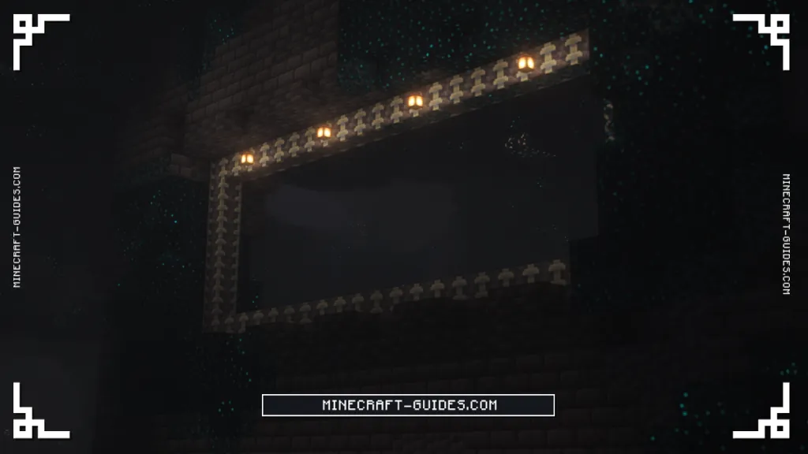

      > **Kritisch:** Bevor du die Andere Seite betrittst, schreib deine Portal-Koordinaten auf!
      > Wenn du das Portal verlierst, ist der einzige Weg zurück in die Oberwelt zu sterben.

   4. Die Andere Seite wendet auf alle Spieler einen permanenten **Dunkelheits-Effekt** an. Der einzige
      Weg, ihn zu entfernen, ist das Tragen eines **Wächterhelms** (hergestellt durch Aufrüsten eines Netherit-
      Helms mit einer Wächter-Upgrade-Schmiedevorlage, die aus Antiken Stadt-
      Kisten mit ca. 60% Spawn-Rate fällt). Du wirst ohne ihn sehr schwer kämpfen.

   5. Die Andere Seite hat vier Biome mit unterschiedlichem Flair und Gefahren:

   | Biom              | Wie es ist                                                      |
   |-------------------|-----------------------------------------------------------------|
   | Tiefland          | Am gefährlichsten; offenes Sculk-Terrain, hohe Kreatur-Dichte  |
   | Echowald          | Violette Echo-Bäume erhellen den Bereich; meist Zerbrochene Kreaturen |
   | Blühende Höhlen   | Blühholz und Anglerfisch; weniger feindselig                    |
   | Bedeckte Säulen   | Hohe Pfeiler; nebelreich; Phantomschwärme                       |

   6. Erkunde den **Antiken Tempel** im Tiefland für die beste Beute. Er hat drei
      Ebenen, jede mit besseren Belohnungen. Brich Antike Vasen vorsichtig -- einige können den
      Antiken Lauerer-Miniboss herbeirufen.

   **Wichtige Deeper and Darker-Belohnungen:**

   | Gegenstand             | Was er tut                                                |
   |------------------------|-----------------------------------------------------------|
   | Wächter-Rüstungsset    | Aufgerüstet von Netherit; negiert Dunkelheitseffekt       |
   | Seelen-Elytra          | Eine verbesserte Elytra, die zufällig ohne Raketen boosted |
   | Sculk-Sender           | Redstone-ähnliches drahtloses Signalgerät                 |
   | Sculk-Knochen          | Fallen von Sculk-Tausendfüßlern; benötigt für Seelen-Elytra |
   | Seelenstaub            | Fällt von der Zerbrochenen Kreatur; benötigt für Seelen-Elytra |
   | Seelenkristall         | Fällt vom Verfolger; benötigt für Seelen-Elytra           |

   > **Warnung:** Der Wächter erscheint immer noch in der Anderen Seite, wenn Sculk-Schreier ausgelöst werden.
   > Schleiche ständig, bewege dich langsam und halte Lärm auf ein Minimum -- die gleichen
   > Regeln wie das Tiefe Dunkel gelten immer noch, aber jetzt mit schlechterer Sicht und mehr Kreaturen.

   **Wiki:** [https://www.minecraft-guides.com/wiki/deeper-and-darker/(https://www.minecraft-guides.com/wiki/deeper-and-darker/)]

[^ Zurück nach oben](#inhaltsverzeichnis)

---

## The Undergarden

**Was ist das?**
The Undergarden ist eine riesige unterirdische Dimension, die unterhalb der Bedrock-Schicht sitzt.
Anders als das feindliche Feuer und die Lava des Nethers ist der Undergarden üppig, dunkel und trieft
vor unheimlicher Atmosphäre -- fremdartige Pilzwälder, giftige Sümpfe, leuchtende Pflanzen und
15 verschiedene Biome. Er hat seinen eigenen Vier-Stufen-Erzfortschritt und ist ein tolles Erkundungs-
ziel für Mittelspiel-Spieler, die etwas anderes suchen.

   
<ins>Ich möchte mehr wissen</ins>

   **So fängst du an:**

   1. Fertige einen **Katalysator** an -- den Gegenstand, der zum Aktivieren des Undergarden-Portals verwendet wird.
      Er wird aus Goldbarren, Eisenbarren und einem Diamanten hergestellt.

      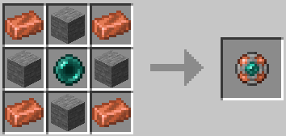

   2. Baue einen Portalrahmen in der gleichen Form wie ein Nether-Portal, aber verwende **Steinziegel**
      oder **Tiefschiefer-Ziegel** anstelle von Obsidian.

   3. Rechtsklicke den **unteren inneren Block** des Rahmens mit dem Katalysator, um
      das Portal zu aktivieren. Tritt hindurch!

      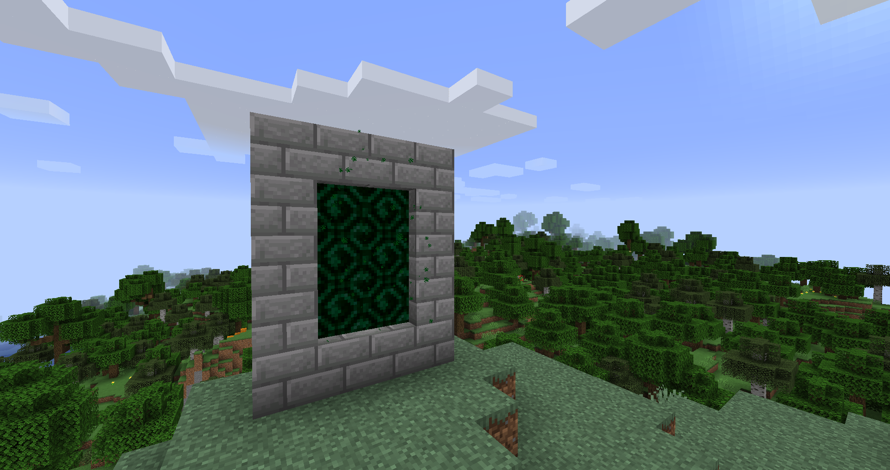

   4. Der Undergarden hat vier Erz- und Ausrüstungsstufen, in Fortschrittsreihenfolge:

      - **Cloggrum** -- die erste Erzstufe; schmelze rohes Cloggrum und fertige Werkzeuge und Rüstung.
      Cloggrum-Werkzeuge sind mit Diamant vergleichbar. Hinweis: Cloggrum-Stöcke (aus lokalen
      Bäumen) sind für das Cloggrum-Werkzeug-Herstellen statt normaler Stöcke erforderlich.
      - **Froststahl** -- erfordert eine Cloggrum-Spitzhacke zum Abbauen. Werkzeuge und Waffen haben
      einen **Kälteeffekt**, der Feinde verlangsamt, wenn du sie triffst.
      - **Utherium** -- oberste Standard-Erzstufe mit hervorragenden Werten.
      - **Vergessen** -- die seltenste und mächtigste Stufe. Vergessene Ausrüstung wird
      aus seltenen **Katakomben**-Strukturen und den Feinden darin erhalten, nicht aus normalem Erz.

   5. Achte auf **Virulente Mischung** -- Pools aus giftigem Wasser, die durch die
      Dimension verstreut sind und normalem Wasser ähneln. Darin zu schwimmen verursacht Schaden. Vermeide
      stehende Flüssigkeitskörper, es sei denn, du bist sicher, was sie sind.

   **Wichtige Undergarden-Gegenstände:**

   | Gegenstand        | Was er tut                                                    |
   |-------------------|---------------------------------------------------------------|
   | Cloggrum-Barren   | Erste Metall-Stufe; Werkzeuge sind mit Diamant vergleichbar   |
   | Froststahl-Barren | Zweite Stufe; Waffen wenden einen Kälte-/Verlangsamungseffekt auf Feinde an |
   | Utherium-Barren   | Dritte Stufe; oberste Standard-Ausrüstung                     |
   | Vergessener Barren | Seltene vierte Stufe; aus Katakombenfeindenobtained          |
   | Katalysator       | Aktiviert das Portal zum Undergarden                          |
   | Cloggrum-Eimer    | Eine Eimer-Variante, die mit Undergarden-Flüssigkeiten funktioniert |

   > **Profi-Tipp:** Der Undergarden hat keinen Tag/Nacht-Zyklus und Kreaturen spawnen ständig.
   > Beleuchte deine Umgebung, während du gehst, und bleibe in Bewegung -- still in der Dunkelheit zu bleiben
   > ist ein Todesurteil. Bring viel Essen mit: die Dimension hat ihre eigenen Essens-Gegenstände
   > (Unterbohne am Stab, Düsterkürbis-Kuchen), die es wert sind, gesammelt zu werden, aber du wirst
   > für deinen ersten Besuch einen soliden Vorrat aus der Oberwelt haben wollen.

[^ Zurück nach oben](#inhaltsverzeichnis)

---

*Der Leitfaden behandelt nur die Kerninhalte. Viele weitere Mods, Funktionen und Geheimnisse warten
darauf, entdeckt zu werden -- die halbe Freude darin besteht darin, sie selbst zu finden. Viel Glück und viel Spaß!*